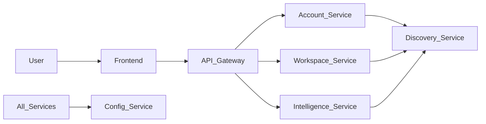

# 🚀 Hateable

> A scalable **microservices-based platform** built with Java (Spring Boot) and a modern React + TypeScript frontend.

---

## ✨ Overview

**Hateable** is a distributed system designed using microservices architecture, enabling modular development, scalability, and cloud-native deployment.

It consists of:

* ⚙️ Independent backend services
* 🌐 API Gateway for routing
* 🧠 Intelligence/processing service
* 💻 Modern frontend UI

---

## 🧩 Features

* 🔐 User authentication & account management
* 🧠 Intelligence & analysis service
* 📁 Workspace/data management
* 🌍 API gateway routing
* ⚡ Scalable and modular microservices

---

## 🏗️ Architecture



---

## 🧱 Microservices

| Service                     | Description                  |
| --------------------------- | ---------------------------- |
| 🚪 **api-gateway**          | Entry point for all requests |
| 🔍 **discovery-service**    | Service registry (Eureka)    |
| ⚙️ **config-service**       | Centralized configuration    |
| 👤 **account-service**      | User & authentication        |
| 🧠 **intelligence-service** | Core logic / AI              |
| 📁 **workspace-service**    | User workspace/data          |
| 📦 **common-lib**           | Shared utilities             |

---

## 📂 Project Structure

```bash
Hateable/
├── Distributed-Hateable/           # Backend microservices
│   ├── api-gateway/
│   ├── discovery-service/
│   ├── config-service/
│   ├── account-service/
│   ├── workspace-service/
│   ├── intelligence-service/
│   ├── common-lib/
│   ├── k8s/                        # Backend Kubernetes configs
│   ├── services.docker-compose.yml
│   └── mvnw / pom.xml
│
├── project-companion/              # Frontend (React + Vite + TypeScript)
│   ├── src/
│   ├── public/
│   ├── package.json
│   └── vite.config.ts
│
├── k8s/                            # Global Kubernetes configs (if any)
├── .gitignore
└── README.md
```

---

## ⚙️ Tech Stack

### 🖥️ Backend

* Java (Spring Boot)
* Maven (Wrapper included)
* Spring Cloud (Config, Eureka, Gateway)

### 🌐 Frontend

* React + TypeScript
* Vite

### ☁️ DevOps & Infra

* Docker & Docker Compose
* Kubernetes (K8s)
* MinIO (object storage)
* Redis (optional caching)

---

## 🚀 Quick Start

### 🔹 Backend (Maven)

```powershell
cd Distributed-Hateable
.\mvnw.cmd clean install -DskipTests
```

---

### 🔹 Run with Docker (Recommended)

```powershell
docker compose -f Distributed-Hateable/services.docker-compose.yml up --build
```

---

### 🔹 Frontend

```bash
cd project-companion
npm install
npm run dev
```

---

## 🔐 Environment Variables

> ⚠️ Never commit secrets. Use `.env` or environment variables.

Example:

```env
GIT_USERNAME=your_username
GIT_PASSWORD=your_token
JWT_SECRET=your_secret
STRIPE_API_KEY=your_key
```

---

## 🧪 Development Notes

* Use `.env.example` for sharing config structure
* Use Docker for consistent local setup
* Use Kubernetes for production deployment

---

## 📌 Highlights

* ⚡ Microservices architecture
* 🔄 Service discovery & centralized config
* 🧠 Extendable intelligence layer
* 🌍 Cloud-ready deployment

---

## 🤝 Contributing

Feel free to fork and contribute 🚀

---

## 📄 License

MIT License

---

## ⭐ Support

If you like this project, give it a ⭐ on GitHub!
